---
layout: image-left
image: "/images/weird-network.png"
---

## Motivation

- Privacy / [Enshittification](https://en.wikipedia.org/wiki/Enshittification)
- Learning:  networks, operations, IaC, etc.
- Saving money?

---
layout: image-right
image: "/images/learning.png"
---

## Disclaimer

- I am new to selfhosting
- This is my learning experience
- slowly reaching status "Enough to be dangerous" 😈

---
layout: two-cols-header
---

## Cloud or Homeserver?

:: left ::

### 🏠 Homeserver

#### Pros

- full control
- privacy: all data is yours
- no vendor lock-in
- low running costs

#### Cons

- initial hardware investment costs
- maintenance of all infrastructure
- availability / scaling

:: right ::

### ☁️ Cloud

#### Pros

- PaaS / SaaS solutions
- availability / scaling
- no hardware investment
- easier setup

#### Cons

- vendor lock-in
- running costs are difficult to predict
- trust issues

---

## Typical Applications

| app | "before" | "after" |
| - | - | - |
| calendar | Google Calendar | ☁️ Nextcloud (Hetzner) |
| file sharing | Google Drive | ☁️ Nextcloud (Hetzner) |
| photos | Google Photos | 🏠 [immich](https://immich.app/) |
| document management | private git | 🏠 [Paperless-NGX](https://docs.paperless-ngx.com/) |
| read-it-later | Pocket (Mozilla) | 🏠 [Readeck](https://readeck.org/) |
| cooking recipes | bookmarks, Chefkoch, etc | 🏠 [Mealie](https://mealie.io/) |

---

## Domain Hosting (current state)

```mermaid
flowchart LR

  cloud("internet")
  hoster("Domain-Name hoster")
  hetzner("☁️ Nextcloud (Hetzner)")
  homeserver("🏠 Homeserver")

  cloud -- *.mydomain.com --> hoster
  hoster -- *.wolke.mydomain.com --> hetzner
  hoster -- (2) *.cloud.mydomain.com --> homeserver
  homeserver -- (1) DynDNS --> hoster

  style hetzner fill:#e6ffe6
  style homeserver fill:#ffe4e1
  style hoster fill:orange
```

I learned something about

- `CNAME` entries
- `A` entries
- wildcards

---

## Domain Hosting (alternative)

Use a Virtual Private Server (VPS) to access Home server

```mermaid
flowchart LR

  cloud("internet")
  hoster("Domain-Name hoster")
  hetzner("☁️ Nextcloud (Hetzner)")
  homeserver("🏠 Homeserver")
  vps("VPS")

  hoster -- *.wolke.mydomain.com --> hetzner
  cloud -- *.mydomain.com --> hoster
  hoster -- *.cloud.mydomain.com --> vps
  vps -- WireGuard --> homeserver
  homeserver -- DynDNS --> hoster

  style vps fill:#ffe4e1
```

- on my "needs more research" list, maybe overkill?
- Safer, but might involve extra costs

---
layout: two-cols-header
---

## Home infrastructure: Bird's eye view

:: left ::

### router (FritzBox)

- I try to keep the router as dumb as possible
- disabled DNS & DHCP
- enabled DynDNS
- [Let's Encrypt](https://letsencrypt.org/): port 80/443 is open ⚠️
- wireguard port is open
- configs are easy to backup & restore

:: right ::

### RPi

- Raspberry Pi 2 Model B (!)
- [Pi-hole](https://pi-hole.net/): DNS & DHCP
- WireGuard (via [PiVPN](https://www.pivpn.io/))
- configs are easy to backup & restore

---
layout: image-right
image: "/images/hardware-costs.png"
---

## Home infrastructure

Hardware: Let's talk about money...

---

## Hardware (1/2): NAS

My old Synology (from 2014)...

- 4 HDDs
- costs (mainly the HDDs): 1000 EUR
- effective storage capacity: 8TB
- Synology's "RAID-5"

YMMV, but you want something solid & tested.

---

## Hardware (2/2): Server

- costs: 320 EUR
- CPU: Intel Alder Lake N95
- RAM: **32GB**
- SSD: **1TB (max 2TB)**

---
layout: image-left
image: "/images/vps-crazy.png"
---

### Accessing Homeserver

- VPN / Wireguard
- Public access
- Geoblocking
- Thoughts?

---
layout: image-right
image: "/images/rabbit-hole.png"
---

## Why Proxmox VMs?

I am not an expert: The more contained my experiments are, the safer I am.

- VMs: **containment** -> safety feature
- builtin **backups**
- VMs can be **orchestrated** with
  - Ansible
  - Terraform

Alternatives (for pros): kubernetes, nix-os

---

## Server: Overview

---
layout: two-cols-header
---

## Outlook

:: left ::

### TODOs

- Setup VMs w/ Terraform
- Add `fail2ban` to public facing `caddy`
- Research Virtual Private Server (VPS) - esp. costs

:: right ::

### We can have a look at details

- Proxmox (live)
- Ansible scripts
- anything else in my network!

:: bottom ::

Let's talk!

---
layout: image
image: "/images/discussion.png"
---

---
src: ./pages/99-end.md
---
