---
layout: image-right
image: "/images/weird-network.png"
---

## Motivation

- Privacy / [Enshittification](https://en.wikipedia.org/wiki/Enshittification)
- Learning:  networks, operations, IaC, etc.
- Saving money?

---

## Disclaimer

- I am new to selfhosting
- This is my learning experience

---
layout: two-cols-header
---

## Cloud or Homeserver?

:: left ::

### 🏠 Homeserver

#### Pros

- full control
- privacy: all data is yours
- no vendor lock-in
- low running costs

#### Cons

- initial hardware investment costs
- maintenance of all infrastructure
- availability
- scaling

:: right ::

### ☁️ Cloud

#### Pros

- PaaS / SaaS solutions
- availability
- scaling
- no hardware investment

#### Cons

- vendor lock-in
- running costs are difficult to predict
- trust issues

---

## Typical Applications

| app | "before" | "after" |
| - | - | - |
| calendar | Google Calendar | ☁️ Nextcloud (Hetzner) |
| file sharing | Google Drive | ☁️ Nextcloud (Hetzner) |
| photos | Google Photos | 🏠 [immich](https://immich.app/) |
| document management | private git | 🏠 [Paperless-NGX](https://docs.paperless-ngx.com/) |
| read-it-later | Pocket (Mozilla) | 🏠 [Readeck](https://readeck.org/) |
| cooking recipes | bookmarks, Chefkoch, etc | 🏠 [Mealie](https://mealie.io/) |

---

## Domain Hosting (current state)

```mermaid
flowchart LR

  cloud("internet")
  hoster("Domain-Name hoster")
  hetzner("☁️ Nextcloud (Hetzner)")
  homeserver("🏠 Homeserver")

  cloud -- *.mydomain.com --> hoster
  hoster -- *.wolke.mydomain.com --> hetzner
  hoster -- *.cloud.mydomain.com --> homeserver
  homeserver -- DynDNS --> hoster
```

- I learned something about `CNAME` and `A` entries

---

## Domain Hosting (alternative)

Use a Virtual Private Server (VPS) to access Home server

- Safer, but might involve extra costs

```mermaid
flowchart LR

  cloud("internet")
  hoster("Domain-Name hoster")
  hetzner("☁️ Nextcloud (Hetzner)")
  homeserver("🏠 Homeserver")
  vps("VPS")

  hoster -- *.wolke.mydomain.com --> hetzner
  cloud -- *.mydomain.com --> hoster
  hoster -- *.cloud.mydomain.com --> vps
  vps -- WireGuard --> homeserver
  homeserver -- DynDNS --> hoster
```

---

## Home infrastructure (1/x)

---

## Home infrastructure (2/x)

- But wait, there is a NAS and a Proxmox server?
- Let's talk about hardware

---

## Hardware (1/2): NAS

NAS

- 4 HDDs
- costs (mainly the HDDs): 1000 EUR
- effective storage capacity: 8TB
- Synology's "RAID-5"

---

## Hardware (2/2): Server

- costs: 320 EUR
- CPU: Intel Alder Lake N95
- RAM: **32GB** DDR4 (3200MHz)
- SSD: **1TB** M.2 NVMe PCIe 3.0 M.2 2280 **(Max 2TB)**

---

## Options for accessing Homeserver

- VPN / Wireguard
- Public access
- Geoblocking

---

## Why did I choose Proxmox?

Alternatives:

- kubernetes
- nix

Both are currently too complex for me.

I picked a different rabbit hole:

- Proxmox with VMs and
  - with Ansible
  - with Terraform (OpenTofu)
- Proxmox VMs provide natural containment -> safety feature
- Proxmox VMs provide an alternative backup strategy

---

## Overview

---

## Discussion

---
src: ./pages/99-end.md
---
