---
layout: image-right
image: "/images/weird-network.png"
---

## Motivation

- Privacy / [Enshittification](https://en.wikipedia.org/wiki/Enshittification)
- Learning:  networks, operations, IaC, etc.
- Saving money?

---

## Disclaimer

- I am new to selfhosting
- This is my learning experience

---
layout: two-cols-header
---

## Cloud or Homeserver?

:: left ::

### 🏠 Homeserver

#### Pros

- full control
- privacy: all data is yours
- no vendor lock-in
- low running costs

#### Cons

- initial hardware investment costs
- maintenance of all infrastructure
- availability
- scaling

:: right ::

### ☁️ Cloud

#### Pros

- PaaS / SaaS solutions
- availability
- scaling
- no hardware investment

#### Cons

- vendor lock-in
- running costs are difficult to predict
- trust issues

---

## Typical Applications

| app | "before" | "after" |
| - | - | - |
| calendar | Google Calendar | ☁️ Nextcloud (Hetzner) |
| file sharing | Google Drive | ☁️ Nextcloud (Hetzner) |
| photos | Google Photos | 🏠 [immich](https://immich.app/) |
| document management | private git | 🏠 [Paperless-NGX](https://docs.paperless-ngx.com/) |
| read-it-later | Pocket (Mozilla) | 🏠 [Readeck](https://readeck.org/) |
| cooking recipes | bookmarks, Chefkoch, etc | 🏠 [Mealie](https://mealie.io/) |

---

## Domain Hosting

```mermaid
flowchart LR

  cloud("internet")
  hoster("Domain-Name hoster")
  hetzner("☁️ Nextcloud (Hetzner)")
  homeserver("🏠 Homeserver")

  cloud -- *.mydomain.com --> hoster
  hoster -- *.wolke.mydomain.com --> hetzner
  hoster -- *.cloud.mydomain.com --> homeserver
```

---
src: ./pages/99-end.md
---
